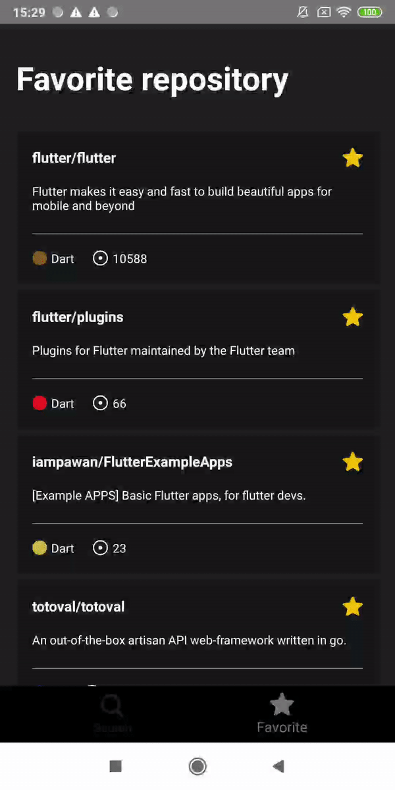

# Kwestia

Kwestia is a an Android app that allows users to search for issues on selected GitHub repositories.
This app is an small demo application based on Android application tech-stacks like RxJava, Toothpick, Room, Retrofit  and MVVM architecture.
Also fetching data from the network and integrating persisted data from the database via repository pattern.

## Android development

Kwestia is an app that attempts to use the latest libraries and tools. As a summary:

* Minimum SDK level 21.
* Entirely written in [Kotlin](https://kotlinlang.org/).
* UI with [View binding](https://developer.android.com/topic/libraries/view-binding).
* Uses [RxJava](https://github.com/ReactiveX/RxJava) throughout
* Uses [LiveData](https://developer.android.com/reference/android/arch/lifecycle/LiveData).
* Uses many of the [Architecture Components](https://developer.android.com/topic/libraries/architecture/) including: Room, Lifecycle, Navigation.
* Uses [Toothpick](https://github.com/stephanenicolas/toothpick) for dependency injection.
* Uses [MockK](https://mockk.io/ANDROID.html) for unit test.

## Architecture

Kwestia is based on MVVM architecture and a repository pattern.

## Development setup

First off, you require the latest [Android Studio Bumblebee](https://developer.android.com/studio) (or newer) to be able to build the app.

### Endpoints

Kwestia use Github open API to :
- Get [Repository](https://docs.github.com/en/rest/reference/search#search-repositories)
- Get [Issue](https://docs.github.com/en/rest/reference/search#search-issues-and-pull-requests)

##  UI
Some screens highlighted are:

### Search repository
[[source](/repository)]

### Favorite repository
[[source](/favorite)]

### Repository issue
[[source](/issue)]

